Nama    : Muhammad Syahrul Gunawan

Kelas   : TI 3D

NIM     : 2341720002

# master_plan

Praktikum 1: Dasar State dengan Model-View

Langkah 1: Buat Project Baru
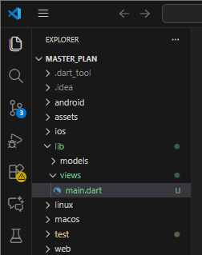

Langkah 2: Membuat model task.dart
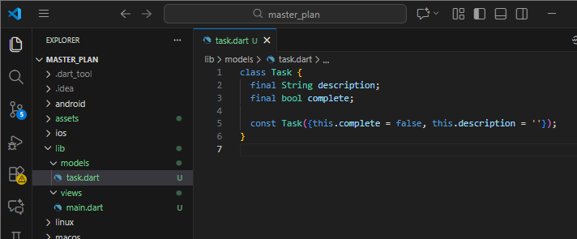

Langkah 3: Buat file plan.dart
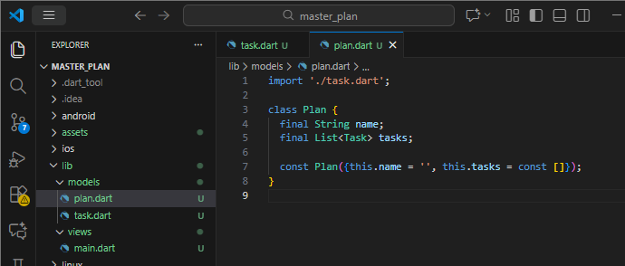

Langkah 4: Buat file data_layer.dart
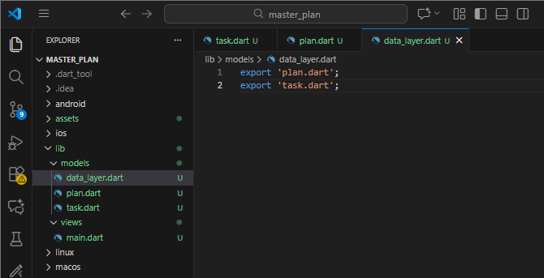

Langkah 5: Pindah ke file main.dart
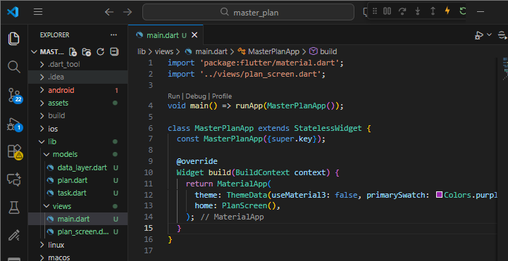

Langkah 6: buat plan_screen.dart
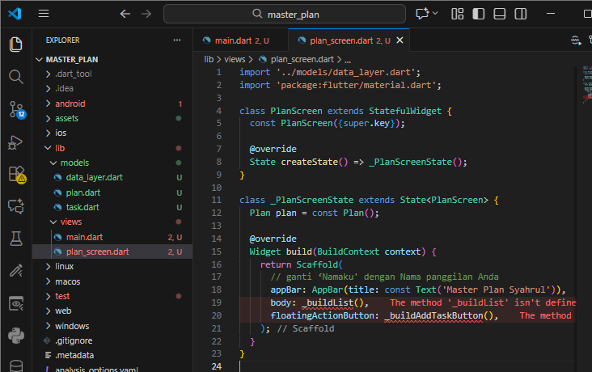

Langkah 7: buat method _buildAddTaskButton()
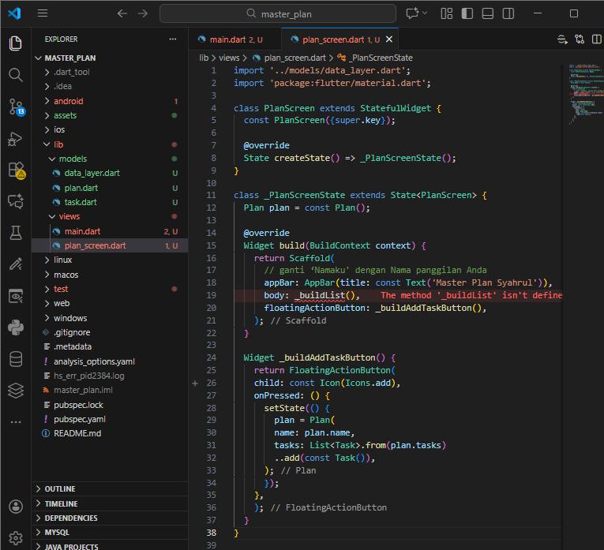

Langkah 8: buat widget _buildList()
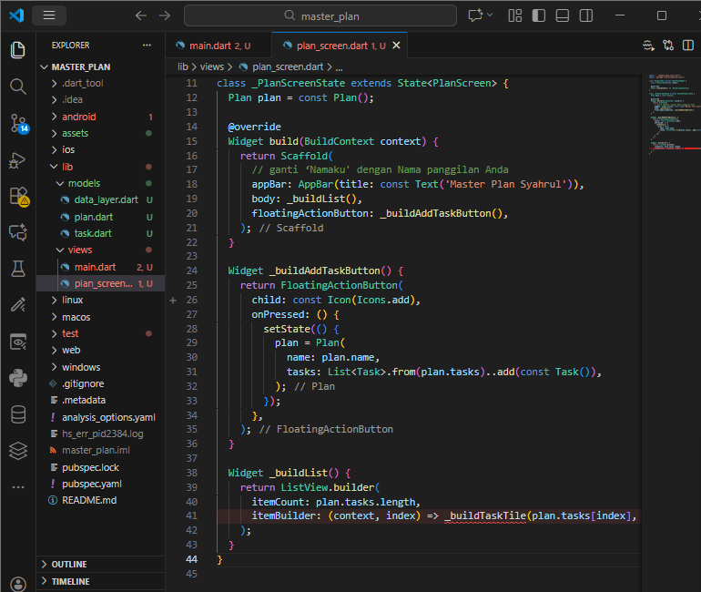

Langkah 9: buat widget _buildTaskTile
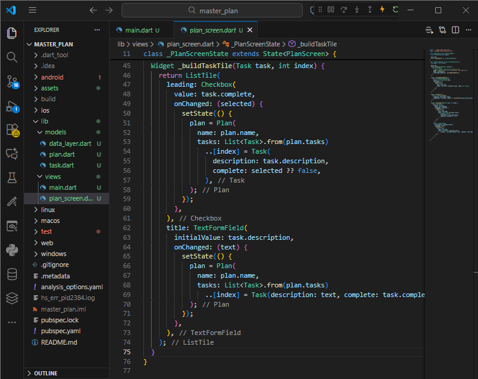
Langkah 9: Output hasil
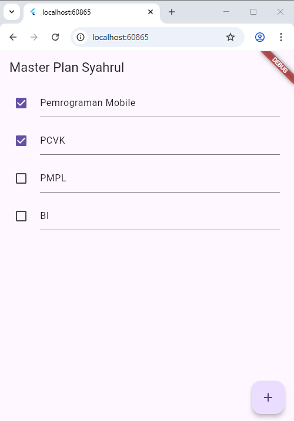

Langkah 10: Tambah Scroll Controller
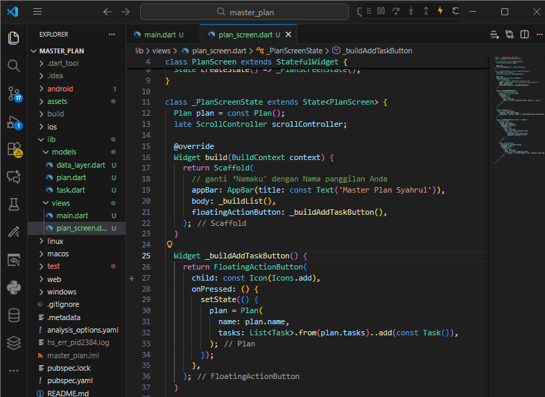

Langkah 11: Tambah Scroll Listener
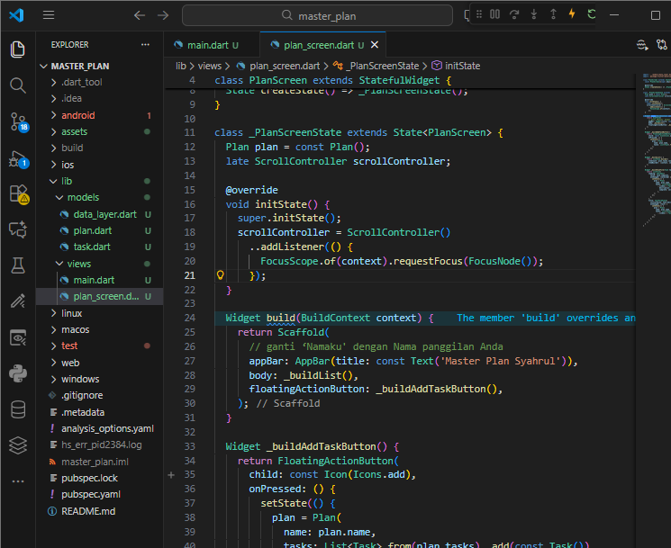

Langkah 12: Tambah controller dan keyboard behavior
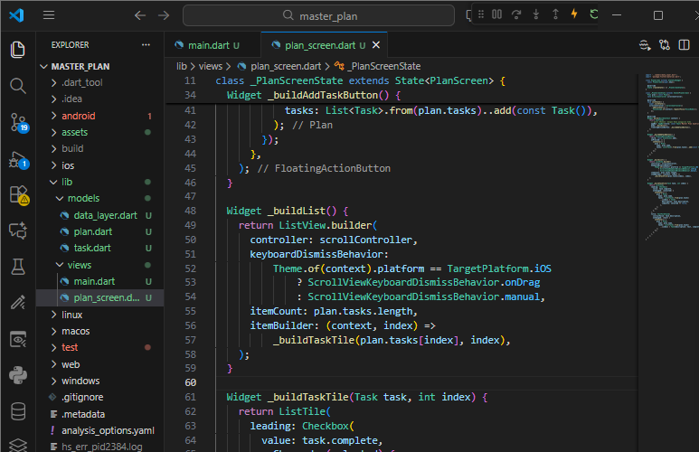

Langkah 13: Terakhir, tambah method dispose()
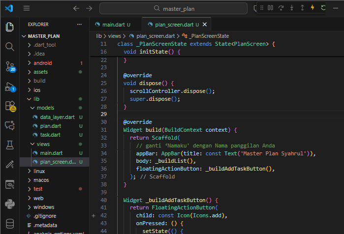

Langkah 14: Hasil

Tugas Praktikum 1: Dasar State dengan Model-View

1. Selesaikan langkah-langkah praktikum tersebut, lalu dokumentasikan berupa GIF hasil akhir praktikum beserta penjelasannya di file README.md! Jika Anda menemukan ada yang error atau tidak berjalan dengan baik, silakan diperbaiki.

Jawab: 
- import './views/plan_screen.dart'; --> perbaikan error pada pemanggilan import di main karena titik kurang 1. Jadi perbakannya seperti berikut --> import './views/plan_screen.dart';.
- theme: ThemeData(primarySwatch: Colors.purple), --> perbaikan pada theme di main karena flutter versi baru (Material 3) tidak lagi memakai primarySwatch untuk AppBar dan FloatingActionButton jadi perbaikannya seperti berikut --> theme: ThemeData(useMaterial3: false, primarySwatch: Colors.purple),.

2. Jelaskan maksud dari langkah 4 pada praktikum tersebut! Mengapa dilakukan demikian?

Jawab: Langkah 4 berfungsi untuk mengelompokkan dan mengekpsor seluruh model data (Task dan Plan) dalam satu file. Tujuannya yaitu untuk mempermudah proses import (View hanya perlu mengimpor satu file), menerapkan best practice Data Layer (Pemisahan yang jelas antara data dan tampilan), dan skalabilitas (Saat model bertambah, file import tetap rapi dan konsisten).

3. Mengapa perlu variabel plan di langkah 6 pada praktikum tersebut? Mengapa dibuat konstanta ?

Jawab: plan berfungsi sebagai state utama aplikasi, menyimpan --> Nama rencana dan Daftar task (List<Task>), setiap perubahan task dilakukan dengan mengganti object plan. Mengapa dibuat const? Immutable Object, data tidak diubah langsung, melainkan dibuat ulang, state Management yang Aman, mencegah perubahan data secara tidak sengaja, performa lebih baik, flutter dapat melakukan optimasi pada object const.

4. Lakukan capture hasil dari Langkah 9 berupa GIF, kemudian jelaskan apa yang telah Anda buat!

Jawab: Pada langkah ini dibuat tampilan setiap item task menggunakan ListTile yang berisi Checkbox untuk menandai task selesai atau belum dan TextFormField untuk mengubah deskripsi task secara langsung. Cara kerjanya: Data task diambil berdasarkan index --> saat checkbox atau teks berubah --> dibuat object Task baru --> list task disalin --> state diperbarui menggunakan setState.

5. Apa kegunaan method pada Langkah 11 dan 13 dalam lifecyle state ?

Jawab: Fungsi --> dipanggil satu kali saat widget pertama kali dibuat, untuk menginisialisasi ScrollController, menambahkan listener untuk menghapus fokus TextField saat scroll dan menutup keyboard (khusus iOS). Peran di lifecycle --> tempat inisialisasi resource sebelum widget ditampilkan.

6. Kumpulkan laporan praktikum Anda berupa link commit atau repository GitHub ke dosen yang telah disepakati !

Praktikum 2: Mengelola Data Layer dengan InheritedWidget dan InheritedNotifier

Langkah 1: Buat file plan_provider.dart
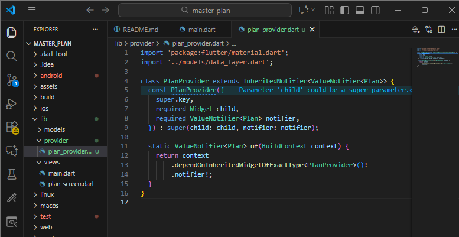

Langkah 2: Edit main.dart
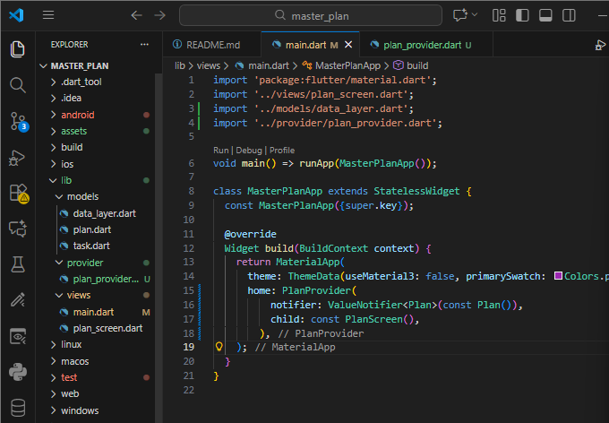

Langkah 3: Tambah method pada model plan.dart
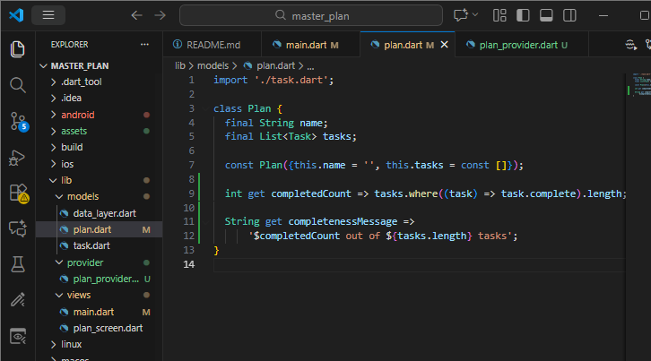

Langkah 4: Pindah ke PlanScreen
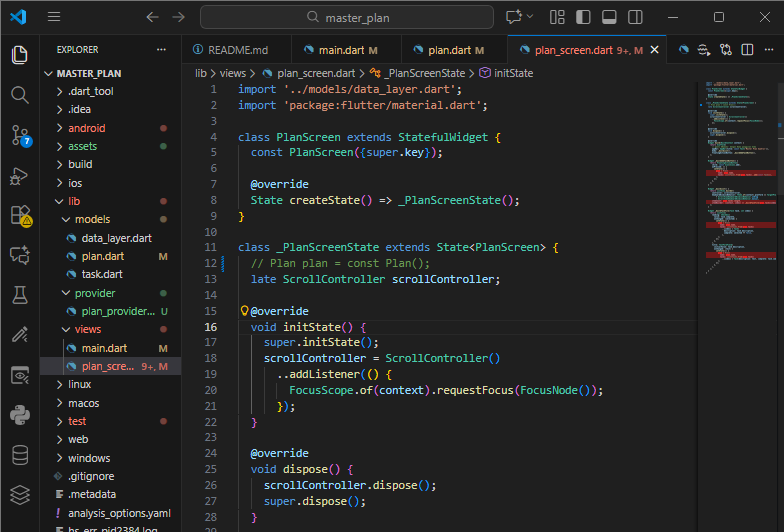

Langkah 5: Edit method _buildAddTaskButton
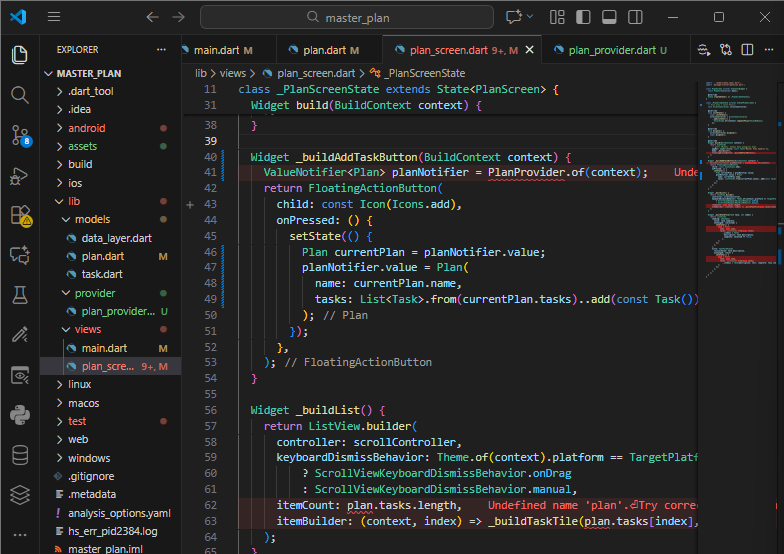

Langkah 6: Edit method _buildTaskTile
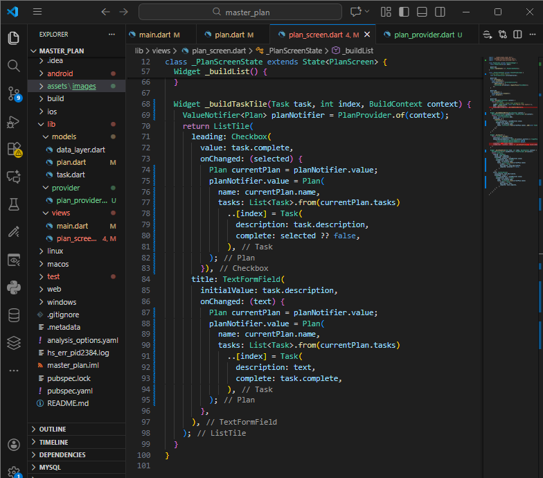

Langkah 7: Edit _buildList
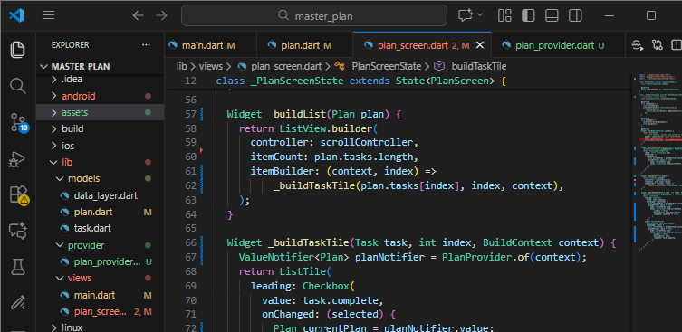

Langkah 8: Tetap di class PlanScreen
Langkah 9: Tambah widget SafeArea
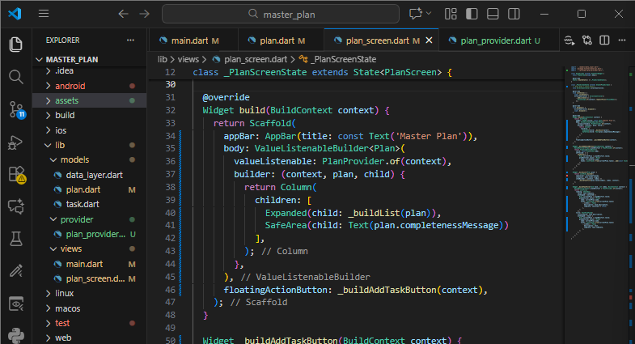
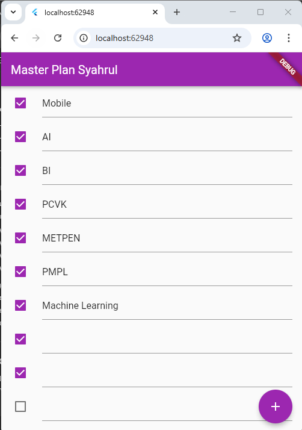

Tugas Praktikum 2: InheritedWidget

1. Selesaikan langkah-langkah praktikum tersebut, lalu dokumentasikan berupa GIF hasil akhir praktikum beserta penjelasannya di file README.md! Jika Anda menemukan ada yang error atau tidak berjalan dengan baik, silakan diperbaiki sesuai dengan tujuan aplikasi tersebut dibuat.

Jawab:
Pada hasil akhir aplikasi:
- User dapat menambahkan task menggunakan tombol Floating Action Button (+)
- Setiap task dapat:
    - Diubah deskripsinya
    - Ditandai selesai (checkbox)
- Progress task ditampilkan di bagian bawah layar
- UI tetap sama seperti Praktikum 1, namun pengelolaan state sudah menggunakan InheritedNotifier

Walaupun tampilan tidak berubah, arsitektur aplikasi sudah jauh lebih baik karena data tidak lagi dikelola langsung oleh widget.

2. Jelaskan mana yang dimaksud InheritedWidget pada langkah 1 tersebut! Mengapa yang digunakan InheritedNotifier?

Jawab: class PlanProvider extends InheritedNotifier<ValueNotifier<Plan>> 

PlanProvider merupakan bentuk InheritedWidget, yaitu widget khusus yang digunakan untuk:
- Menyediakan data ke seluruh widget turunannya
- Menghindari pengiriman data secara manual (prop drilling)

InheritedWidget tidak tampil di UI, tetapi menjadi penghubung antara data layer dan view layer.

Mengapa menggunakan InheritedNotifier?

InheritedNotifier dipilih karena:
- Ia merupakan turunan dari InheritedWidget
- Terintegrasi langsung dengan Listenable (ValueNotifier)
- Otomatis memberi tahu widget yang bergantung ketika data berubah

Keuntungan utama:
- UI akan rebuild otomatis saat Plan berubah
- Tidak perlu memanggil setState() di seluruh widget
- Lebih efisien dan bersih untuk state management

3. Jelaskan maksud dari method di langkah 3 pada praktikum tersebut! Mengapa dilakukan demikian?

Jawab: 

int get completedCount => tasks
  .where((task) => task.complete)
  .length;

String get completenessMessage =>
  '$completedCount out of ${tasks.length} tasks';

Method ini dibuat dalam model Plan untuk:
- completedCount --> Menghitung jumlah task yang sudah selesai
- completenessMessage --> Menyediakan pesan ringkasan progres task (misalnya: 2 out of 5 tasks)

Mengapa dilakukan demikian?
- Memindahkan logika bisnis ke model
- View hanya bertugas menampilkan data
- Mengikuti prinsip Separation of Concerns
- Membuat kode lebih mudah dirawat dan diuji

4. Lakukan capture hasil dari Langkah 9 berupa GIF, kemudian jelaskan apa yang telah Anda buat!

Jawab: 

Pada Langkah 9:
- Widget ListView dibungkus dengan Expanded
- Seluruh konten ditempatkan dalam Column
- Ditambahkan SafeArea di bagian bawah untuk menampilkan: plan.completenessMessage

Selain itu:
- Digunakan ValueListenableBuilder
- UI akan otomatis diperbarui ketika data Plan berubah

Hasilnya:
- Progress task tampil di footer
- UI lebih responsif
- Tidak bergantung pada setState()

5. Kumpulkan laporan praktikum Anda berupa link commit atau repository GitHub ke dosen yang telah disepakati !