Nama    : Muhammad Syahrul Gunawan

Kelas   : TI 3D

NIM     : 2341720002

# hello_world

Praktikum 3: Membuat Repository GitHub dan Laporan Praktikum

A new Flutter project.

Langkah 12:
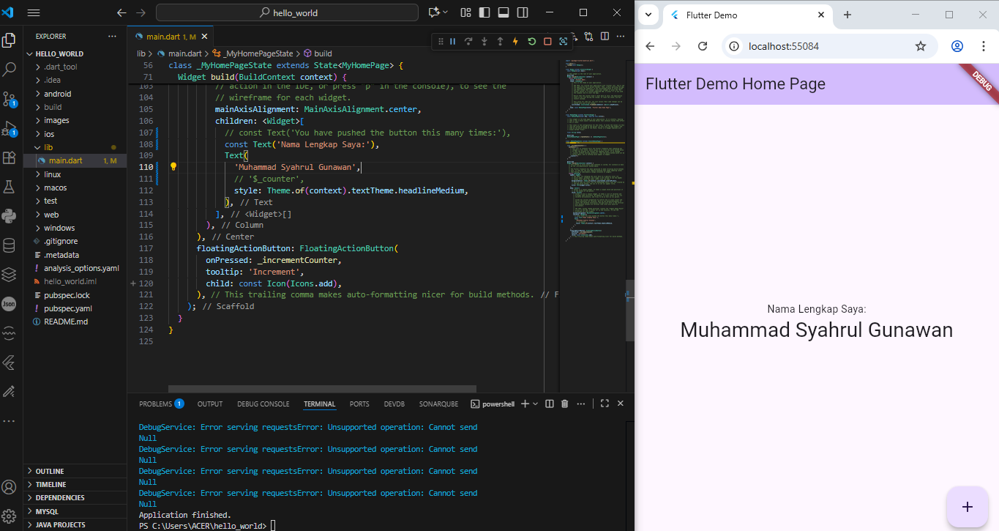

Praktikum 4: Menerapkan Widget Dasar

Langkah 1: Text Widget
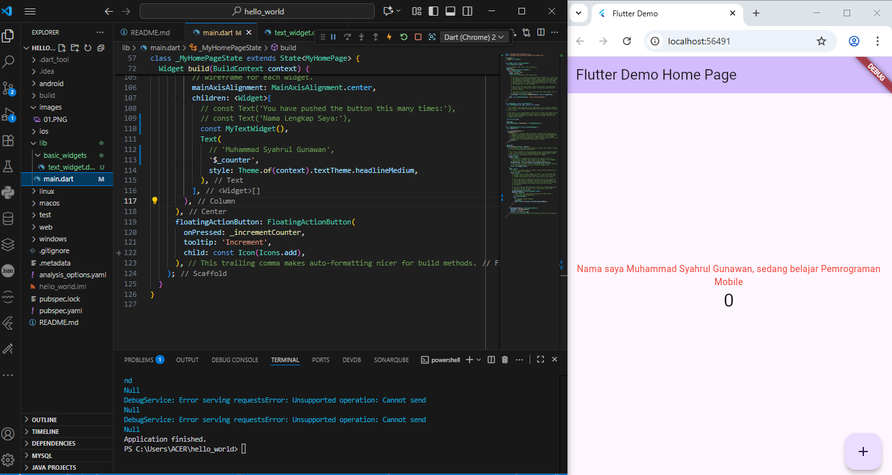
Langkah 2: Image Widget
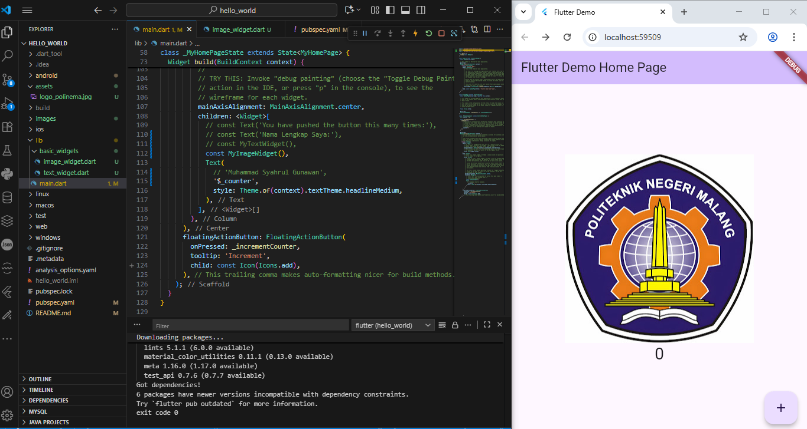

Praktikum 5: Menerapkan Widget Material Design dan iOS Cupertino

Langkah 1: Cupertino Button dan Loading Bar
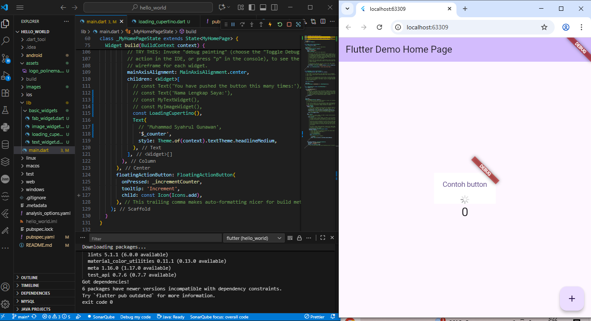
Langkah 2: Floating Action Button (FAB)
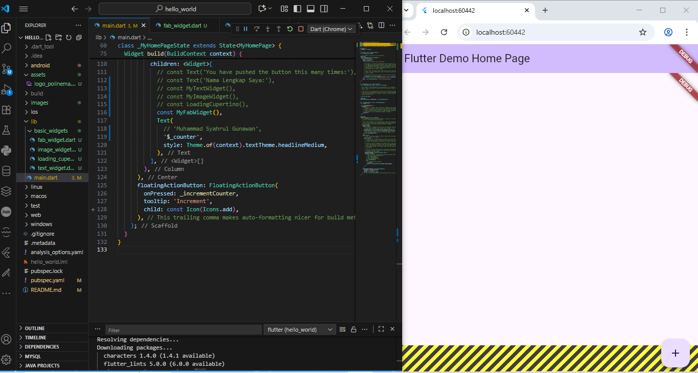
Langkah 3: Scaffold Widget

Tampilan awal
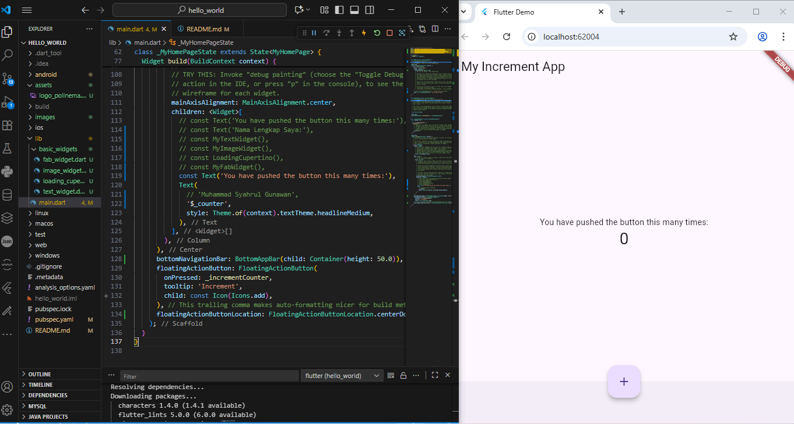
Tampilan setelah diklik button tambah
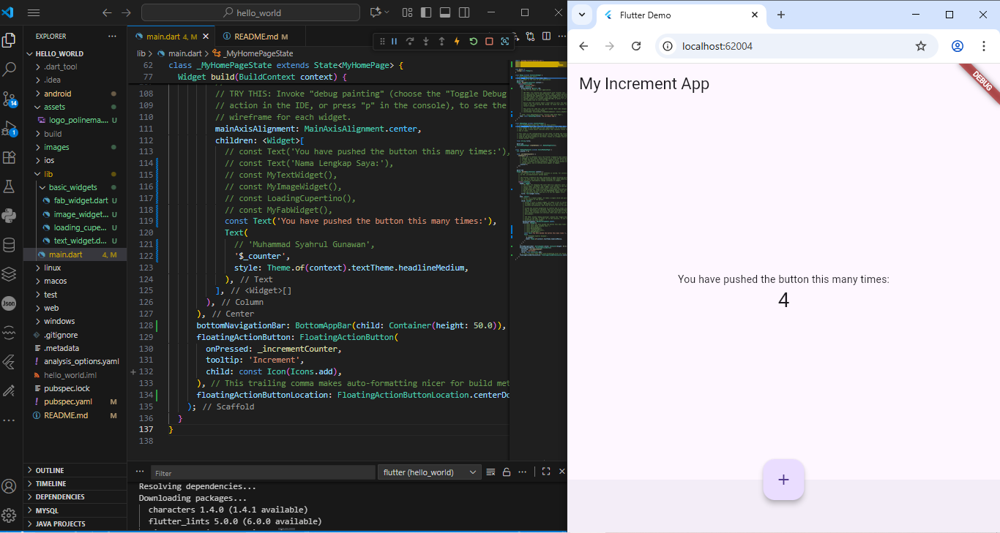
Langkah 4: Dialog Widget

Tampilan awal
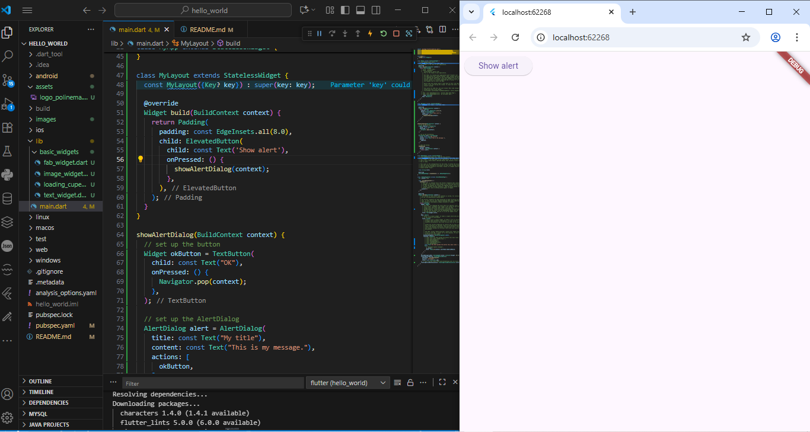
Tampilan setelah diklik (show alert)
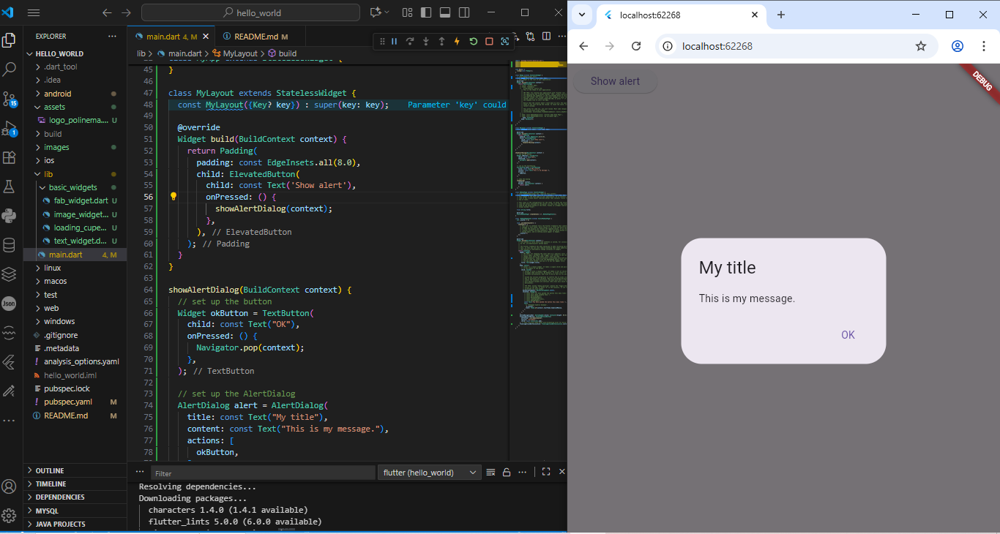
Langkah 5: Input dan Selection Widget

Tampilan awal
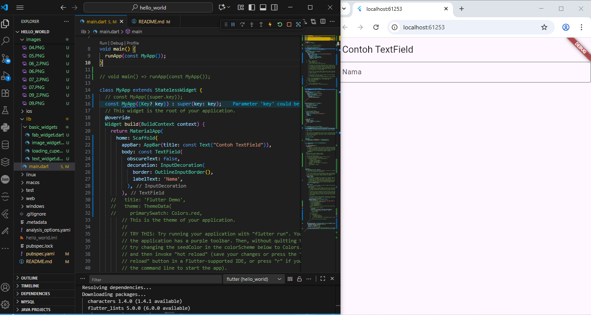
Tampilan setelah kolom diisi nama lengkap
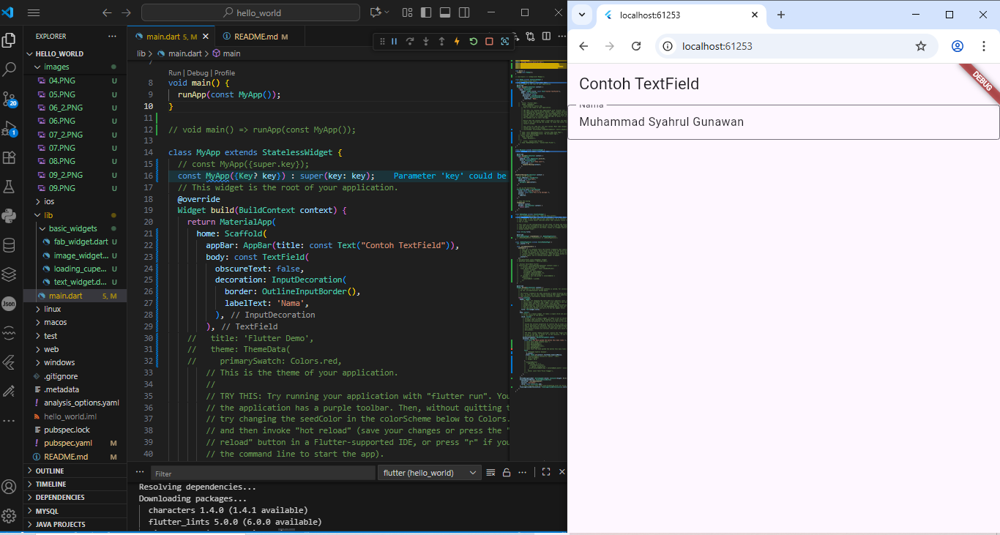
Langkah 6: Date and Time Pickers

Tampilan awal
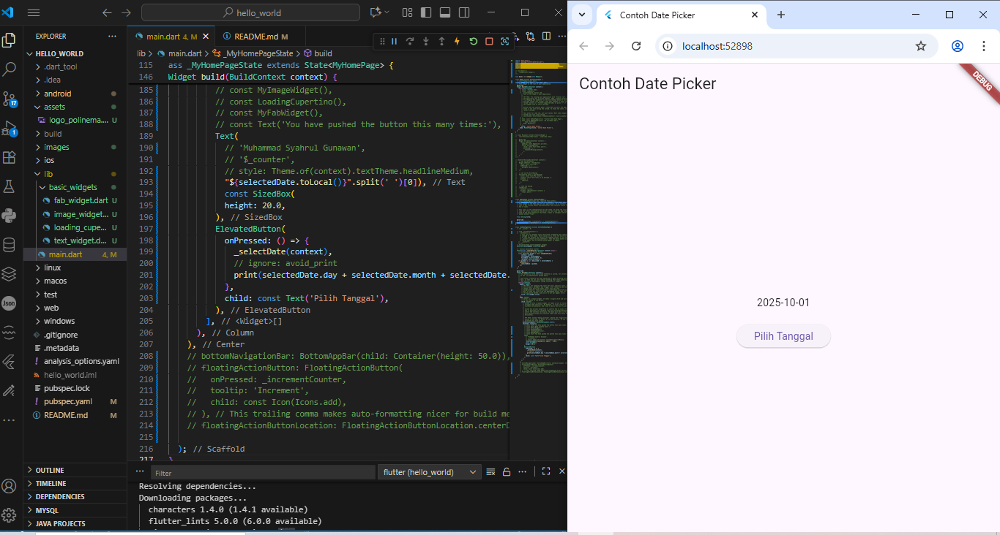
Tampilan setelah diklik (pilih tanggal)
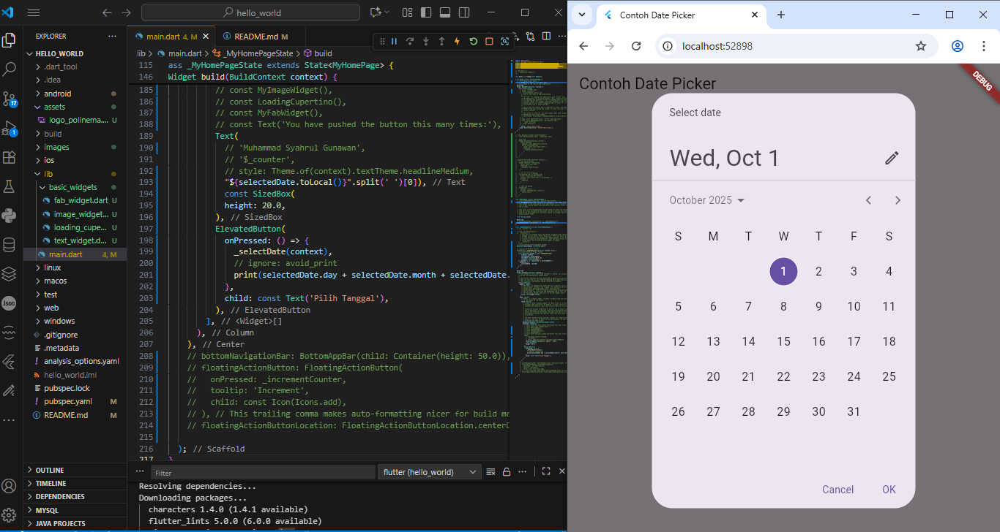