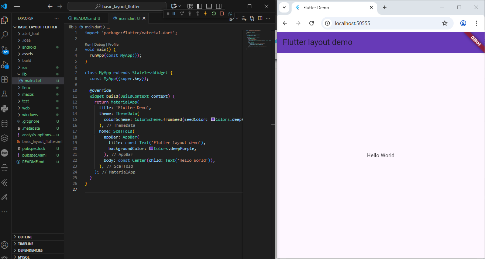
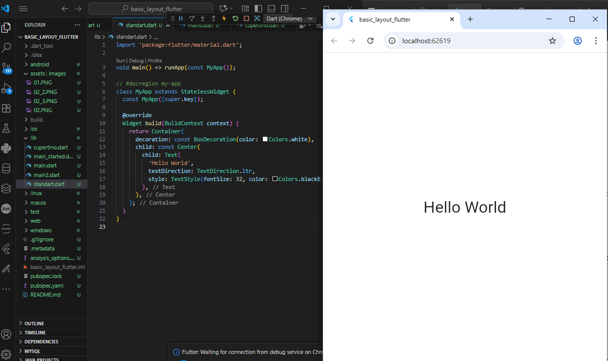
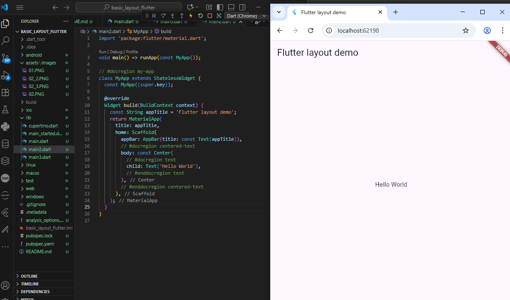
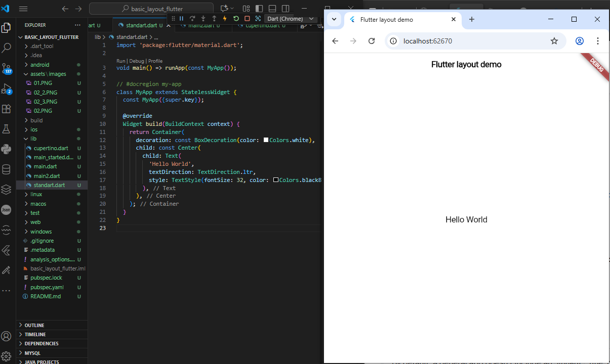
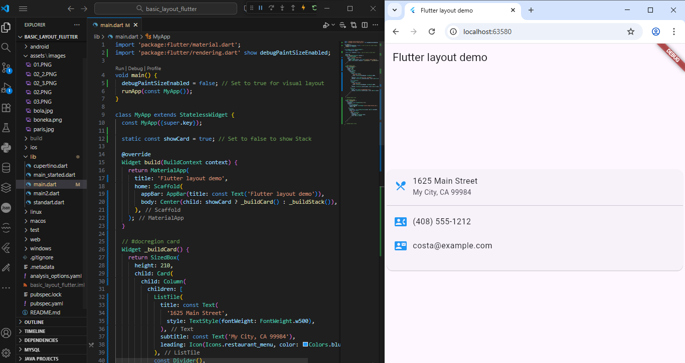
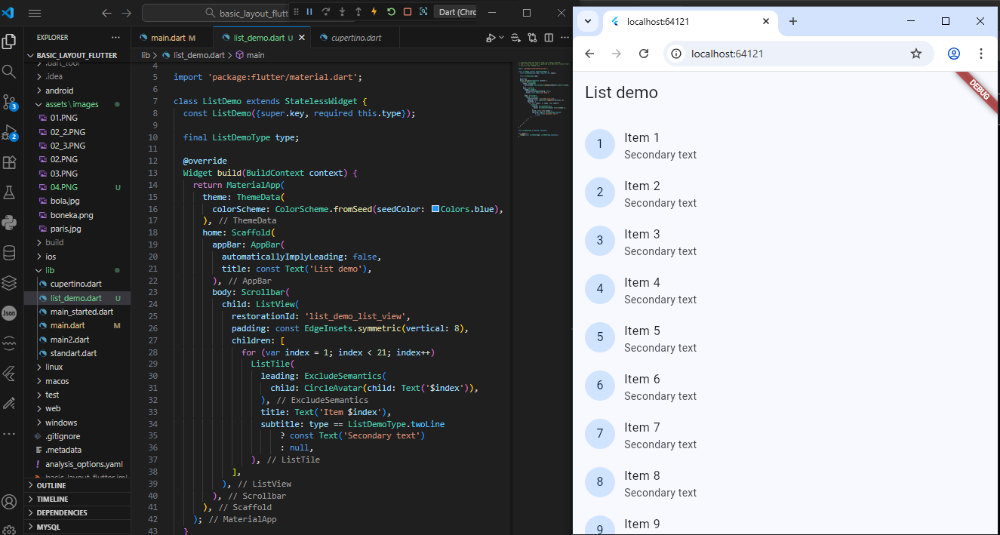
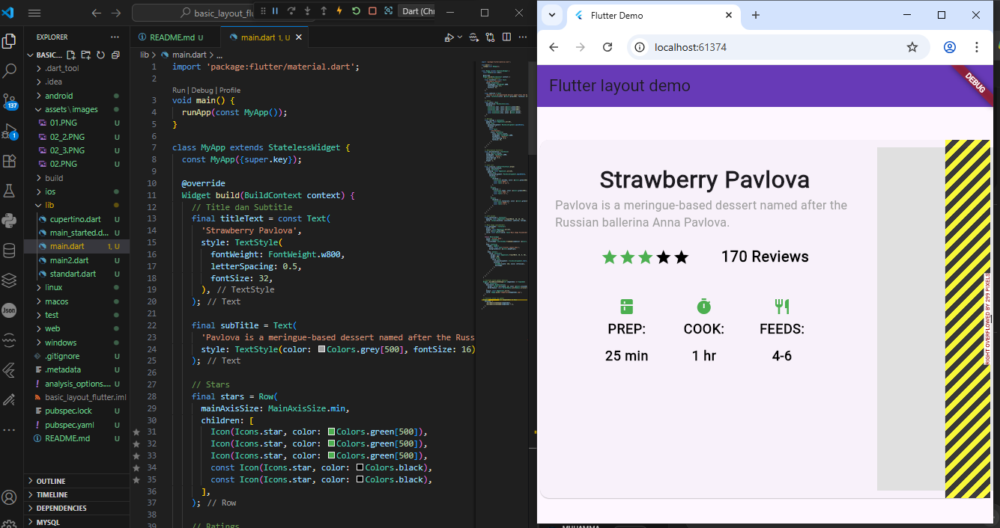

Nama    : Muhammad Syahrul Gunawan

Kelas   : TI 3D

NIM     : 2341720002

# basic_layout_flutter

Lay out a widget

1: Select a layout widget
2: Create a visible widget
3: Add the visible widget to the layout widget

Praktikum 4: Add the layout widget to the page

Praktikum 5: Run your app

Non-Material app
Standart apps

Material apps

Cupertino apps

Card

List

Percobaan Projet
