Nama    : Muhammad Syahrul Gunawan

Kelas   : TI 3D

NIM     : 2341720002

# belanja

Praktikum 5: Membangun Navigasi di Flutter

Langkah 1: Siapkan project baru
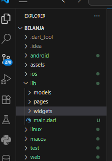

Langkah 2: Mendefinisikan Route
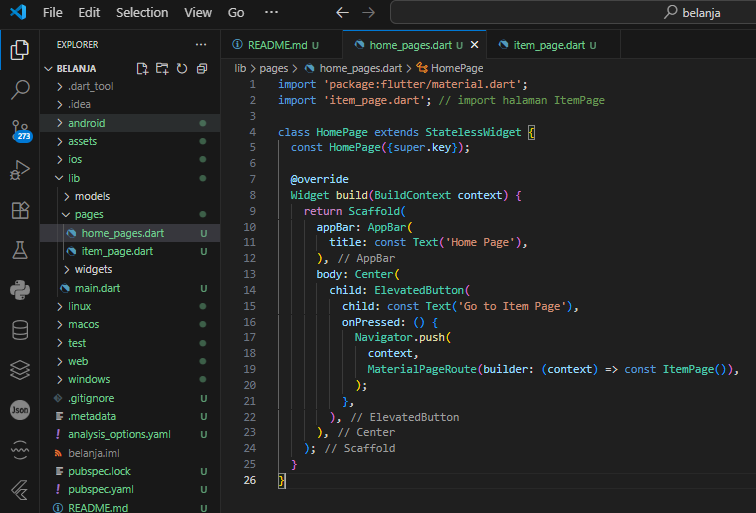
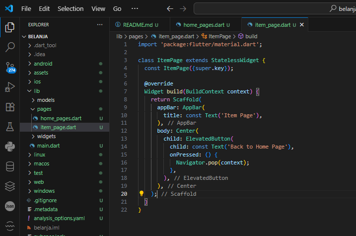

Langkah 3: Lengkapi Kode di main.dart
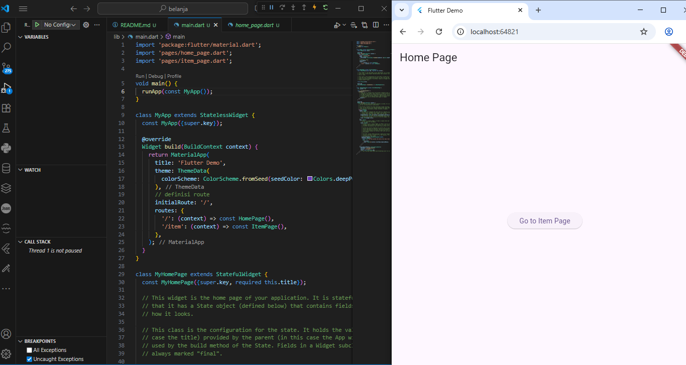
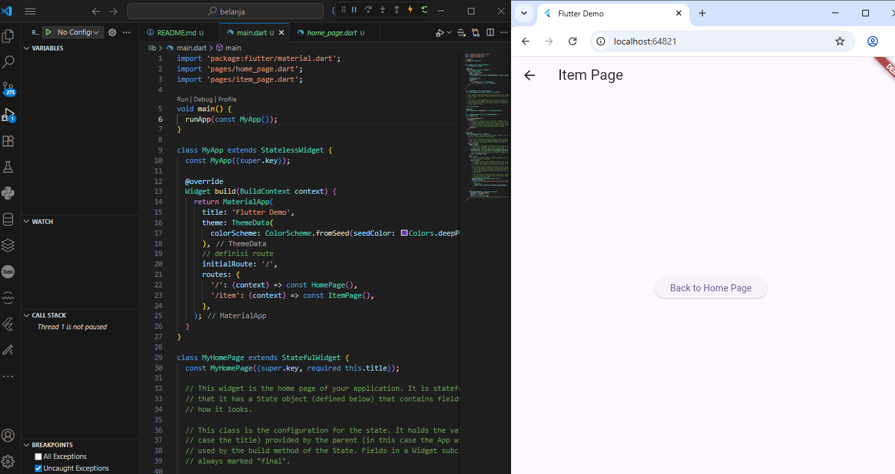

Langkah 4: Membuat data model
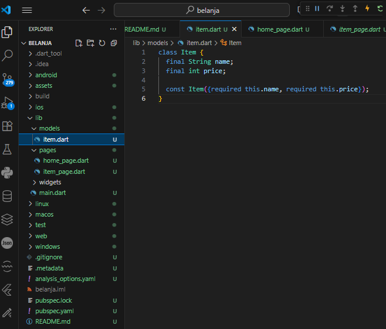

Langkah 5: Lengkapi kode di class HomePage
Langkah 6: Membuat ListView dan itemBuilder
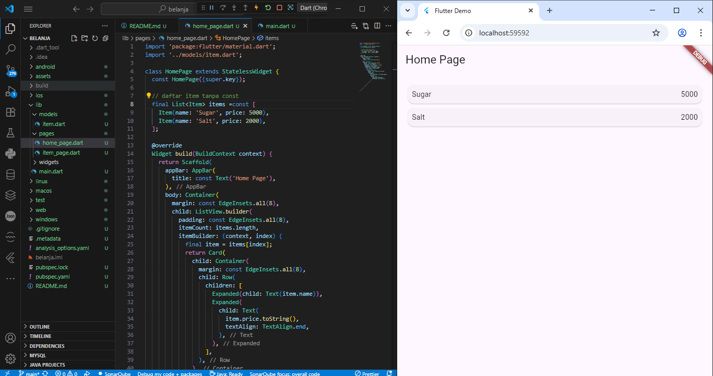

Langkah 7: Menambahkan aksi pada ListView

Sebelum diklik
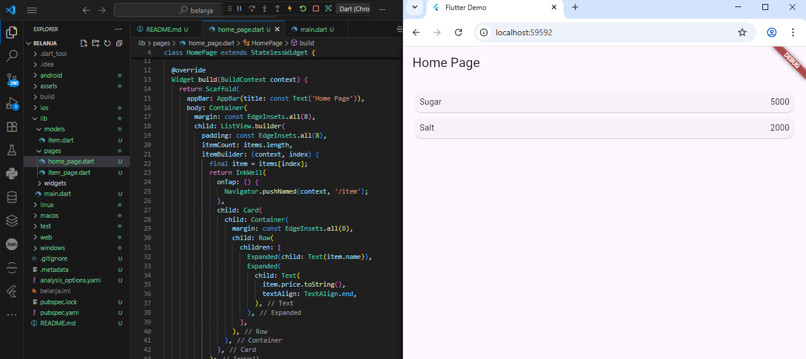
Setelah diklik
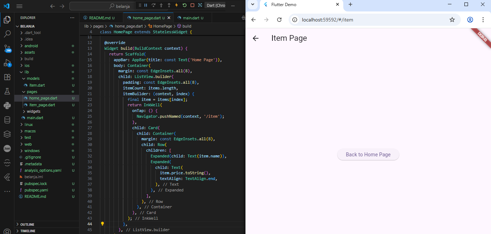

Tugas Praktikum 2

1&2

Sebelum diklik
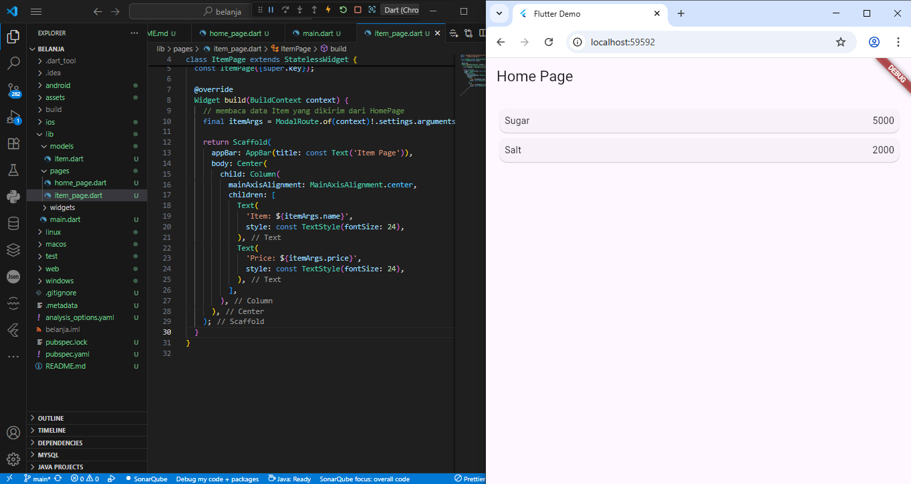
Setelah diklik
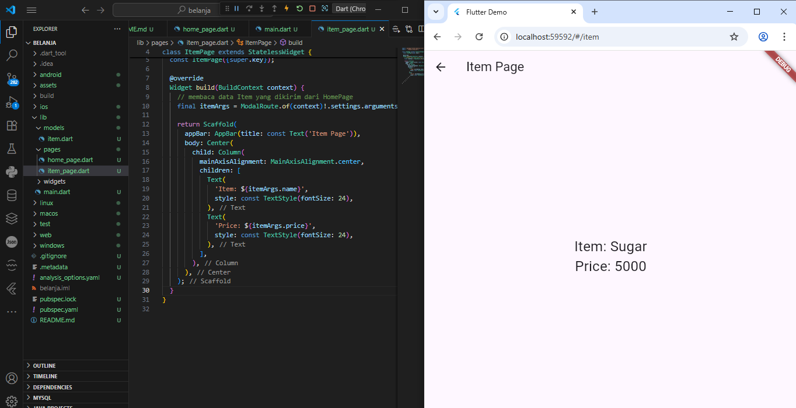

3

4

5

6