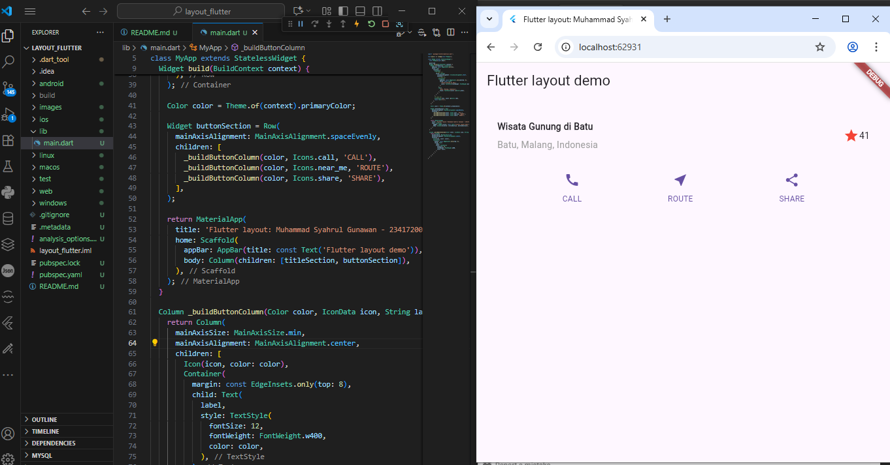

Nama    : Muhammad Syahrul Gunawan

Kelas   : TI 3D

NIM     : 2341720002

# layout_flutter

Praktikum 1: Membangun Layout di Flutter

Langkah 1:

Langkah 2:

Langkah 3 & 4:

Praktikum 2: Implementasi button row

Langkah 1:

Langkah 2:

Langkah 3:

Praktikum 3: Implementasi text section

Langkah 1:

Langkah 2:

Praktikum 4: Implementasi image section

Langkah 1:

Langkah 2:

Langkah 3:

