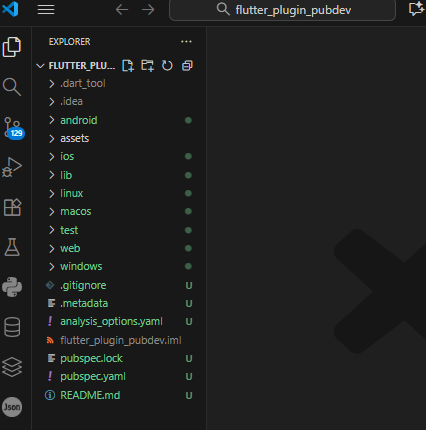
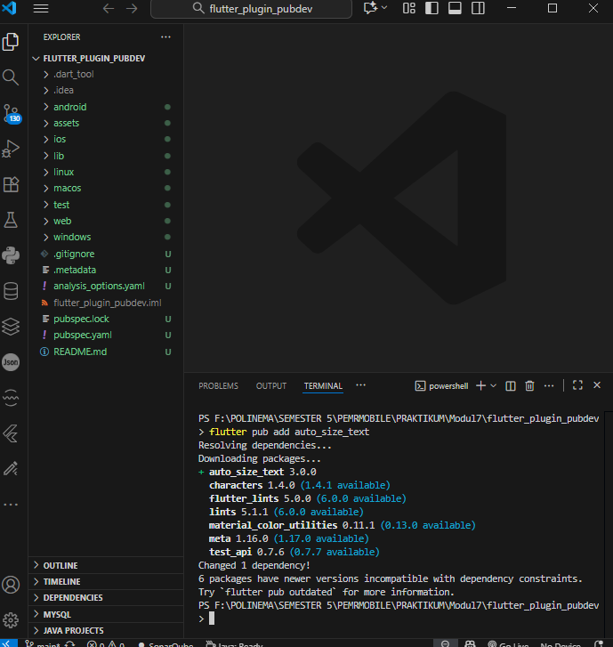
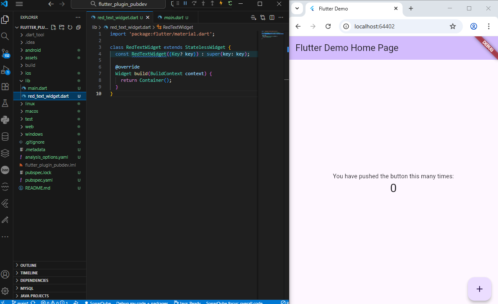
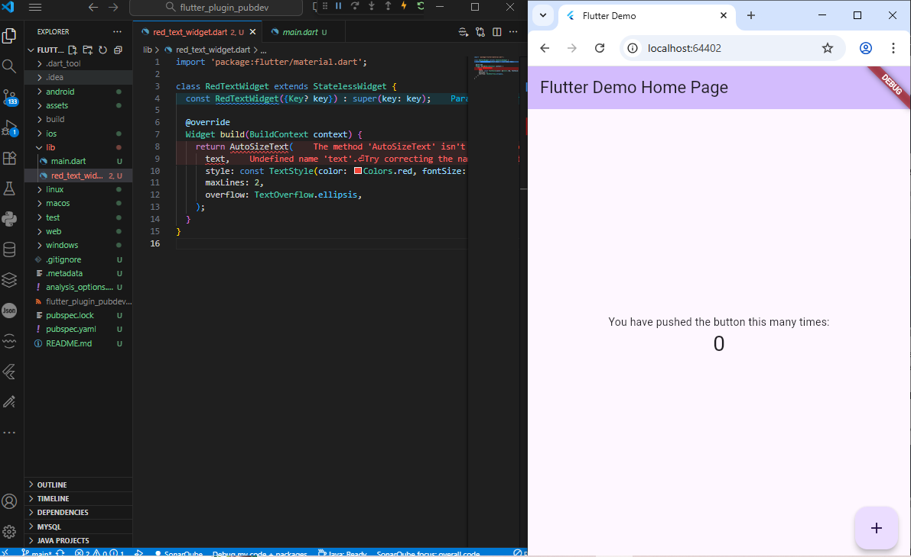
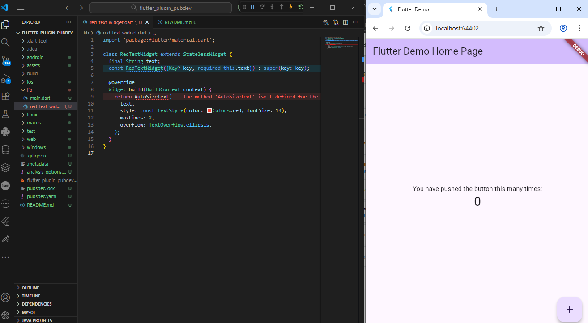
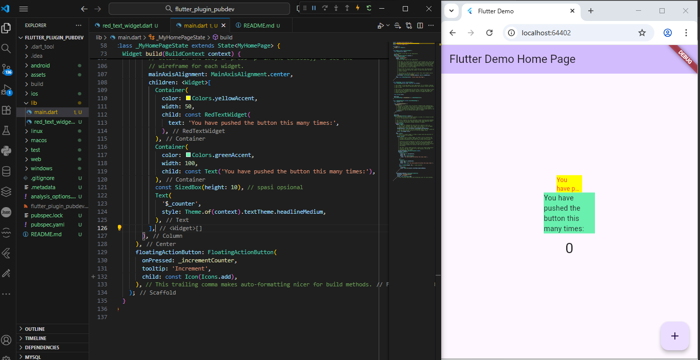

Nama    : Muhammad Syahrul Gunawan

Kelas   : TI 3D

NIM     : 2341720002

# flutter_plugin_pubdev

Praktikum Menerapkan Plugin di Project Flutter

Langkah 1: Buat Project Baru

Langkah 2: Menambahkan Plugin

Langkah 3: Buat file red_text_widget.dart

Langkah 4: Tambah Widget AutoSizeText

Jawab:

Error terjadi karena AutoSizeText tidak dikenali. AutoSizeText berasal dari package eksternal. Jika package tidak ditambahkan di pubspec.taml, program akan tetap error. Selain itu text juga tidak pernah didefinisikan atau dikirim melalui constructor. 

Langkah 5: Buat Variabel text dan parameter di constructor

Langkah 6: Tambahkan widget di main.dart

Tugas Praktikum

2. Jelaskan maksud dari langkah 2 pada praktikum tersebut!

Jawab:

Langkah ini bertujuan untuk menambahkan pustaka (library) eksternal bernama auto_size_text ke dalam proyek Flutter, supaya bisa menggunakan widget AutoSizeText di dalam aplikasi.

3. Jelaskan maksud dari langkah 5 pada praktikum tersebut!

Jawab:

Langkah ini dilakukan agar widget RedTextWidget bisa menerima teks dari luar (parameter) ketika dipanggil, bukan hanya menampilkan teks yang ditulis langsung di dalam kelasnya.

4. Pada langkah 6 terdapat dua widget yang ditambahkan, jelaskan fungsi dan perbedaannya!

Jawab:

Dua widget ditambahkan untuk membandingkan tampilan teks. RedTextWidget menggunakan AutoSizeText yang dapat menyesuaikan ukuran teks secara otomatis agar muat dalam wadah kecil dan menampilkan teks berwarna merah. Sedangkan widget Text bawaan Flutter hanya menampilkan teks dengan ukuran tetap dan warna default tanpa penyesuaian otomatis. Percobaan ini menunjukkan perbedaan antara penggunaan plugin eksternal dan widget standar Flutter dalam mengatur tampilan teks.

5. Jelaskan maksud dari tiap parameter yang ada di dalam plugin auto_size_text berdasarkan tautan pada dokumentasi ini !

Jawab:

a. key --> Mengontrol bagaimana satu widget menggantikan widget lain di dalam pohon (widget tree). Biasanya digunakan untuk melacak perubahan widget saat dibangun ulang.

b. textKey --> Menetapkan key khusus untuk Text widget yang dihasilkan di dalam AutoSizeText.

c. style --> Jika tidak bernilai null, digunakan untuk menentukan gaya teks seperti ukuran huruf, warna, ketebalan, dan lainnya. Sama seperti pada widget Text.

d. minFontSize --> Ukuran huruf terkecil yang diizinkan ketika teks menyesuaikan ukuran otomatis. Jika presetFontSizes digunakan, parameter ini akan diabaikan.

e. maxFontSize --> Ukuran huruf terbesar yang diizinkan saat teks menyesuaikan ukuran otomatis. Jika presetFontSizes digunakan, parameter ini juga akan diabaikan.

f. stepGranularity --> Menentukan seberapa besar langkah pengurangan ukuran font setiap kali AutoSizeText mencoba menyesuaikan teks agar muat. Semakin kecil nilainya, semakin halus penyesuaiannya.

g. presetFontSizes --> Menentukan daftar ukuran font yang diizinkan secara spesifik. Jika digunakan, minFontSize, maxFontSize, dan stepGranularity akan diabaikan. Ukuran font dalam daftar ini harus dalam urutan menurun (descending).

h. group --> Menyinkronkan ukuran teks dari beberapa AutoSizeText agar semua memiliki ukuran huruf yang sama berdasarkan teks yang paling kecil. Cocok untuk tampilan grid atau tabel.

i. textAlign --> Menentukan perataan teks secara horizontal, misalnya: kiri, kanan, tengah, atau rata. Sama seperti pada widget Text.

j. textDirection --> Menentukan arah penulisan teks, apakah dari kiri ke kanan (LTR) atau kanan ke kiri (RTL). Mempengaruhi cara textAlign bekerja.

k. locale --> Menentukan lokal atau bahasa yang digunakan untuk memilih font, terutama jika karakter Unicode bisa ditampilkan berbeda di setiap lokal.

l. softWrap --> Menentukan apakah teks boleh terputus (dibungkus) di titik pemisah baris lunak (soft line breaks). Biasanya diatur ke true.

m. wrapWords --> Menentukan apakah kata yang tidak muat dalam satu baris boleh dibungkus ke baris berikutnya. Nilai default adalah true, agar berperilaku seperti widget Text.

n. overFlow --> Menentukan bagaimana teks yang melebihi batas tampilan (overflow) akan ditangani, misalnya dengan ellipsis (...), dipotong, atau dibiarkan meluap.

o. overFlowReplacement --> Widget pengganti yang akan ditampilkan jika teks terlalu panjang dan tidak muat di area yang tersedia. Misalnya menampilkan teks “Terlalu panjang untuk ditampilkan”.

p. textScaleFactor --> Menentukan skala ukuran teks terhadap ukuran logis piksel. Mempengaruhi minFontSize, maxFontSize, dan presetFontSizes. Biasanya digunakan untuk menyesuaikan aksesibilitas ukuran teks.

q. maxLines --> Jumlah maksimum baris yang dapat digunakan untuk menampilkan teks. Jika teks lebih panjang dari jumlah ini, maka akan ditangani sesuai pengaturan overflow.

r. semanticsLabel --> Label alternatif untuk kebutuhan accessibility atau pembaca layar (screen reader). Biasanya digunakan agar teks mudah dikenali bagi pengguna disabilitas.