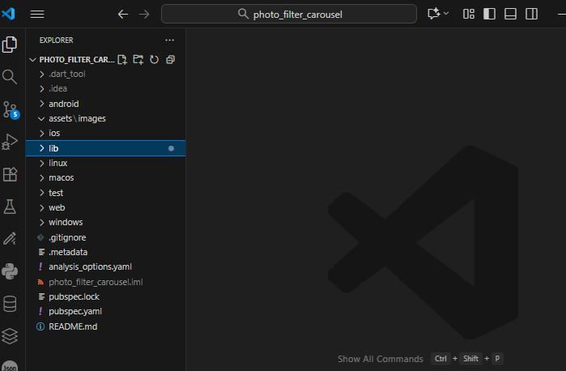
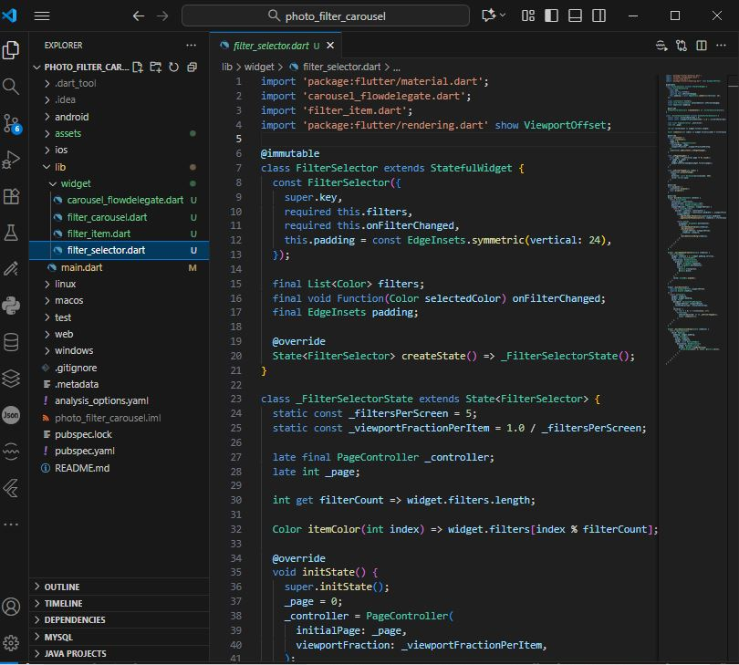
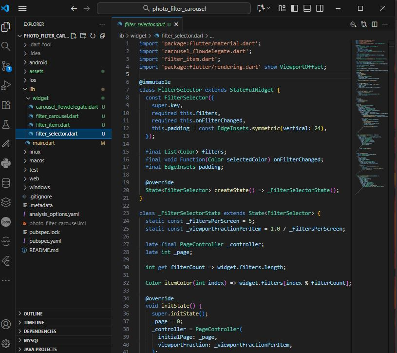
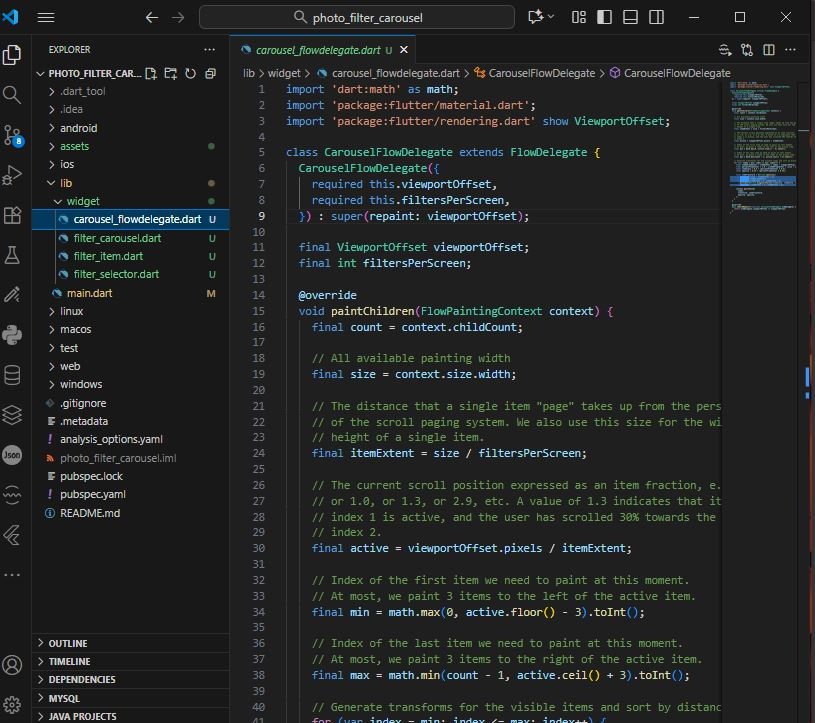
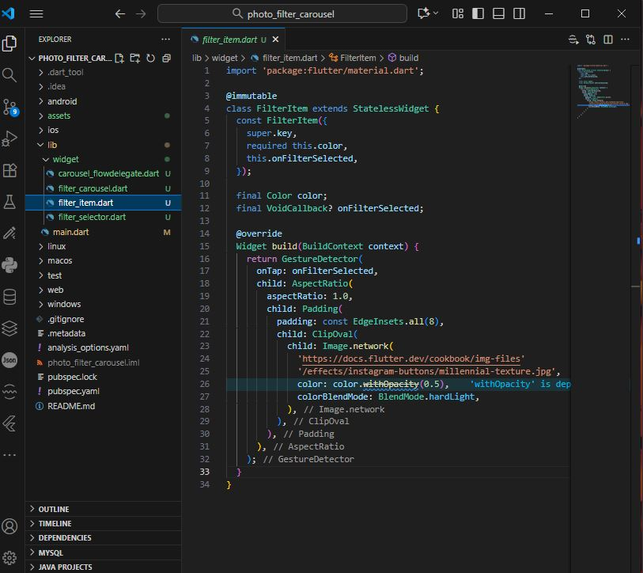
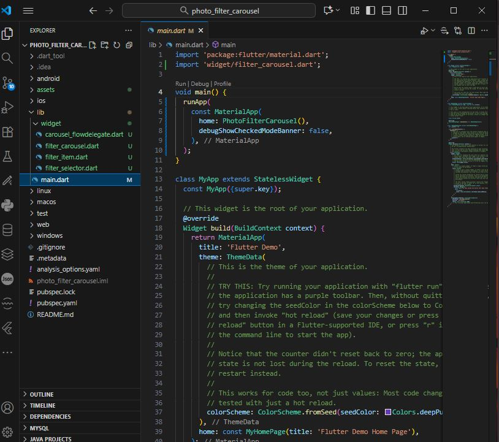
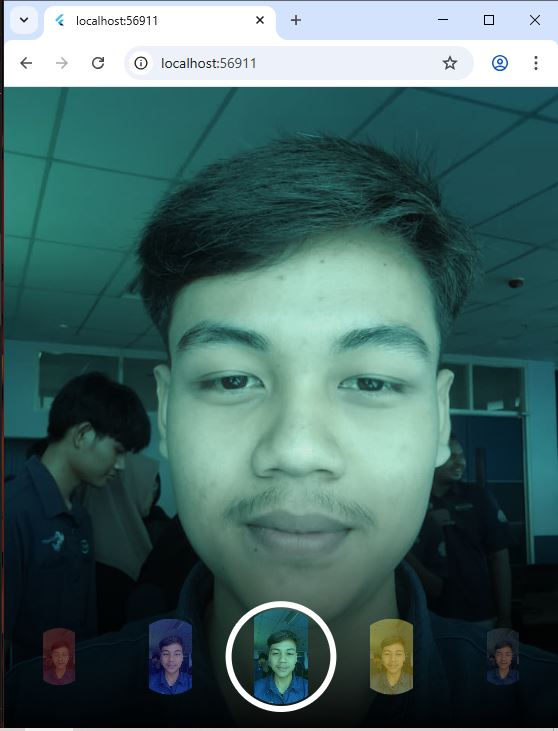

Nama    : Muhammad Syahrul Gunawan

Kelas   : TI 3D

NIM     : 2341720002

# photo_filter_carousel

Praktikum 2: Membuat photo filter carousel

Langkah 1: Buat Project Baru

Langkah 2: Buat widget Selector ring dan dark gradient

Langkah 3: Buat widget photo filter carousel

Langkah 4: Membuat filter warna - bagian 1

Langkah 5: Membuat filter warna

Langkah 6: Implementasi filter carousel

